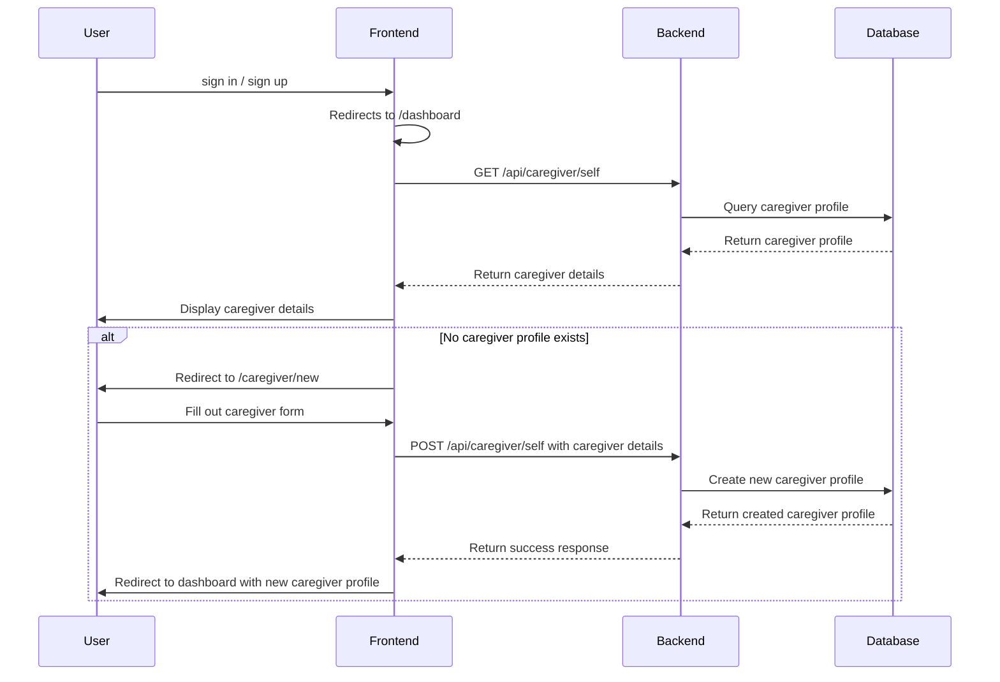

# Caregiver Onboarding

## Problem

When a user first signs up / in via the authentication provider, we have no information about them. We need to collect their details to create a caregiver profile.

## Solution

When a user first signs up or logs in, they are redirected to the `/caregiver/new` onboarding page. This page will collect the necessary information to create a caregiver profile.

## Implementation Steps

1. Create `caregivers` table in the database with the following fields:

   - `id`: TEXT, primary key, will be matched with the authentication provider's JWT `sub`
   - `name`: String, required
   - `phone`: String, optional
   - `address`: String, optional
   - `createdAt`: Timestamp, default to current time

2. Create endpoints in the backend:

   - `POST /api/caregiver/self`: Create a new caregiver profile
   - `GET /api/caregiver/self`: Get the current user's caregiver profile

3. Create a frontend page at `/caregiver/new`:

   - Use a form to collect caregiver details (name, phone, address)
   - On form submission, call the `POST /api/caregiver/self` endpoint to create the profile
   - Redirect to the dashboard page upon successful creation

4. Add a `useCaregiver` hook in the frontend to manage caregiver state:
   - Fetch caregiver details using `GET /api/caregiver/self`
   - Provide methods to create and update caregiver details
   - _Redirect to the onboarding page if no caregiver profile exists_
