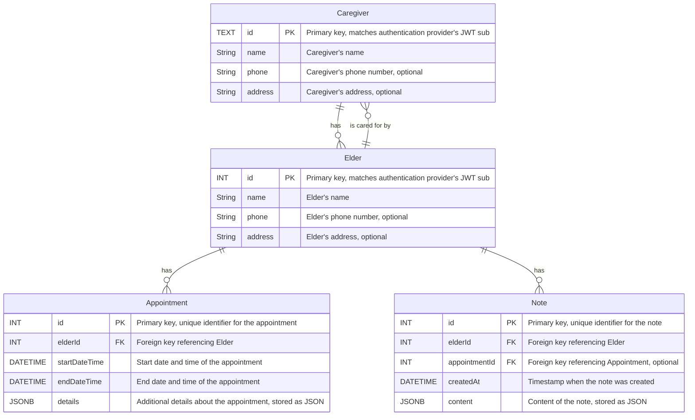

# Database Schema

```mermaid
erDiagram
		Caregiver {
			TEXT id PK "Primary key, matches authentication provider's JWT sub"
			String name "Caregiver's name"
			String phone "Caregiver's phone number, optional"
			String address "Caregiver's address, optional"
		}

		Elder {
			INT id PK "Primary key, matches authentication provider's JWT sub"
			String name "Elder's name"
			String phone "Elder's phone number, optional"
			String address "Elder's address, optional"
		}

		Appointment {
			INT id PK "Primary key, unique identifier for the appointment"
			INT elderId FK "Foreign key referencing Elder"
			DATETIME startDateTime "Start date and time of the appointment"
			DATETIME endDateTime "End date and time of the appointment"
			JSONB details "Additional details about the appointment, stored as JSON"
		}

		Note {
			INT id PK "Primary key, unique identifier for the note"
			INT elderId FK "Foreign key referencing Elder"
			INT appointmentId FK "Foreign key referencing Appointment, optional"
			DATETIME createdAt "Timestamp when the note was created"
			JSONB content "Content of the note, stored as JSON"
		}

		Caregiver ||--o{ Elder : "has"
		Elder ||--o{ Caregiver : "is cared for by"
		Elder ||--o{ Appointment : "has"
		Elder ||--o{ Note : "has"
```
